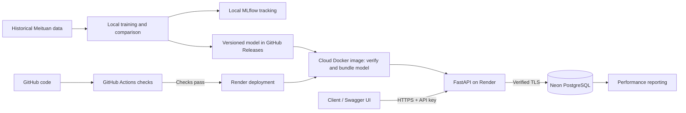

# Delivery Intelligence & ETA Reliability Platform

I built this project to learn how to take a delivery ETA model from a notebook to
an application someone can use. It predicts the minutes between courier acceptance
and delivery, serves the result through FastAPI, and stores predictions and actual
arrival times in PostgreSQL so I can measure the errors later.

The API is deployed on Render, with the database on Neon. Training and MLflow run
locally. This is a portfolio project using historical delivery data, not a live
delivery service.

## What works today

- Reproducible training with shared feature code for training and inference.
- A comparison of Ridge, random forest, CatBoost, and a median baseline.
- A saved CatBoost model with a version and checksum verified before serving.
- API-key-protected prediction and outcome endpoints.
- PostgreSQL storage, Alembic migrations, and performance reports that exclude demo data.
- Docker packaging and GitHub Actions tests, including real PostgreSQL integration tests.
- A cloud deployment tested from an API request through to the stored delivery outcome.

## Architecture



| Tool | How I use it |
|---|---|
| Python, pandas, scikit-learn, CatBoost | Data preparation, feature building, and model comparison |
| uv | Locked dependencies and project commands |
| MLflow | Local experiment metrics and artifact tracking |
| FastAPI and Pydantic | HTTP endpoints and input validation |
| PostgreSQL, SQLAlchemy, Alembic | Prediction/outcome storage and schema migrations |
| Docker and Compose | Packaged API and local database setup |
| GitHub Actions | Automated tests and a Docker build/import check |
| Render and Neon | Hosted API and PostgreSQL database |

The model is included in the cloud image, so requests do not download it again.
The API runs one worker. `/live` checks that the model is loaded; `/health` also
checks the database. Database credentials and the API key are configured privately
in Render, not committed to this repository.

## Model selection

I compared the models on the same six input features and four expanding time
splits covering October 19–22, 2022. Together, the validation splits contain
274,461 orders. I used time splits to keep training before validation, and required
training labels to be available before each split boundary.

| Model | MAE (minutes) | RMSE (minutes) | Total training time, four folds |
|---|---:|---:|---:|
| CatBoost | 6.7308 | 8.7697 | 23.59 s |
| Ridge | 6.8340 | 8.8998 | 1.37 s |
| Random forest | 7.1731 | 9.3371 | 38.28 s |
| Training median | 7.9637 | 10.5067 | 0.01 s |

I kept CatBoost because it had the lowest MAE on each validation day. The gap over
Ridge is small—about six seconds of MAE—and Ridge trains much faster. Ridge also
performed better on unseen couriers, which is a limitation worth keeping visible.
The comparison did not replace the existing October 22 serving artifact.

These are development results on historical data, not measured cloud accuracy or
an untouched final holdout. See [the comparison report](docs/model_comparison.md)
for preprocessing, per-day and courier results, timing methodology, and settings.

## Cloud checks completed

On October 2, 2026, I checked the following on the deployed service:

| Check | Observed result |
|---|---|
| Health endpoint | `ready`, with the expected model version |
| Authorized demo prediction | 32.264926 minutes, matching the local prediction |
| Prediction storage | Matching prediction ID and `demo` source in Neon |
| Request without an API key | Rejected with `Invalid or missing API key.` |
| Simulated delivery outcome | 35-minute actual duration; signed error −2.735074 minutes |
| Outcome storage | Outcome joined to the correct prediction in Neon |

The negative error means the model underestimated the duration. This single demo
checks the application flow; it does not establish real-world model quality.
The cloud-preparation test suite also passed 61 tests locally. A local Docker
check loaded the saved model and predicted within a 512 MiB memory limit; this is
not a measurement of hosted peak memory or sustained cloud load.

## Try the demo

The hosted demo requires an API key for write requests. Ask me for demo access;
keys are not included in this repository.

- [Live API documentation](https://delivery-intelligence-api-2z5u.onrender.com/docs)
- [Readiness check](https://delivery-intelligence-api-2z5u.onrender.com/health)

1. Open `/health` to check readiness.
2. Open `/docs`, click **Authorize**, and enter the supplied API key.
3. Expand **POST /predict**, click **Try it out**, and leave `data_source` as `demo`.
4. Submit this synthetic request:

```json
{
  "platform_order_time": 1666407600,
  "order_push_time": 1666407660,
  "grab_time": 1666407720,
  "poi_id": 1,
  "da_id": 0,
  "courier_id": 2,
  "is_prebook": 0
}
```

For the v1 model, the response should contain approximately `32.264926` minutes,
`1666409655.8955743` as the estimated arrival timestamp, model version
`87a38ec8f34d4ed0a47437a3b1e120ee`, and a new `prediction_id`.

To test outcome recording, use **POST /predictions/{prediction_id}/outcome** with
the ID from your own response and this body:

```json
{
  "actual_arrival_unix_s": 1666409820
}
```

This simulates a 35-minute delivery and should return an absolute error of about
2.735 minutes. Submit the outcome once; a duplicate returns `409`. Logging out of
Swagger authorization and retrying a write request should return `401`.

These timestamps intentionally describe a historical example. Keep the source
as `demo`: simulated outcomes are excluded from real-performance reporting.
The free hosting service can sleep, so the first request may take longer.

## Dataset and scope

I use historical operational delivery data from the Meituan-INFORMS TSL Research
Challenge. Raw data is not included in this repository.

V1 covers on-demand orders with valid acceptance and completion timestamps.
Pre-booked orders and records without usable targets are excluded. Features are
order age and queue age at acceptance, restaurant ID, delivery-area ID, courier
ID, and acceptance hour. The feature builder uses Asia/Shanghai time.

This scope excludes cancelled or incomplete deliveries and does not predict their
outcomes. Restricting labels to each time boundary also underrepresents deliveries
that span midnight. I have not implemented a separate model for unseen couriers.

## Run locally

From the project root, install the locked environment and run the checks:

```bash
uv sync --locked --group dev
uv run --locked pytest -q
```

Train the established October 22 validation experiment:

```bash
uv run --locked eta-train
```

Default behavior: train on records accepted before October 22 whose delivery labels
are known before that boundary; evaluate October 22 acceptances completed before
October 23. Later records are counted in the audit but are not evaluated. Boundary
exclusions intentionally preserve the notebook protocol, but underrepresent orders
that span midnight. This is a development evaluation, not a claim of a pristine
holdout or production readiness.

Other existing development folds can be reproduced explicitly:

```bash
uv run --locked eta-train --validation-start 2022-10-21 --validation-end 2022-10-22
```

Each invocation creates a new directory under `artifacts/models/<run-id>/` containing:

- `model.cbm`: the native CatBoost model.
- `manifest.json`: feature contract, data/model checksums, split, versions, settings,
  source-code fingerprints, and Git state.
- `metrics.json`: train/validation metrics, constant and promise baselines, and
  seen/unseen-courier results.
- `data_audit.json`: eligibility counts, exclusions, and split counts.
- `source_snapshot/`: exact package code, project configuration, and dependency lock.

The model is reloaded and checked against in-memory predictions before tracking
completes. Training artifacts stay local and are ignored by Git. I published the selected
model binary separately as a GitHub release asset for deployment. Raw data is
never copied into the model bundle or uploaded by training.

## Inspect experiments

MLflow uses `artifacts/mlflow/mlflow.db` for local experiment metadata and
`artifacts/mlflow/run_artifacts/` for artifact copies. SQLite is only the local
experiment backend; the deployed application stores predictions and outcomes in
Neon PostgreSQL. This milestone logs native model bundles as run artifacts; model-registry
promotion and a production alias are not implemented yet.

```bash
uv run --locked mlflow ui --backend-store-uri sqlite:///artifacts/mlflow/mlflow.db --host 127.0.0.1 --port 5000
```

Open `http://127.0.0.1:5000` and select the `delivery-eta-v1` experiment.

## Predict from the saved artifact

Use the exact bundle path printed by training in place of `<run-id>`:

```bash
uv run --locked eta-predict --model-dir artifacts/models/<run-id> --input docs/example_acceptance.json
```

The sample is a synthetic event, not a source delivery record. JSON accepts one
object or a list of objects. Required fields are `platform_order_time`,
`order_push_time`, `grab_time` (positive Unix seconds), and `poi_id`, `da_id`,
`courier_id` (nonnegative integer identifiers; zero is valid). Times must satisfy
creation <= push <= acceptance. Requests are on-demand by contract; if provided,
`is_prebook` must be zero. Fractional timestamps, booleans, missing identifiers,
and non-finite values are rejected.

The shared feature builder derives ages and acceptance hour in Asia/Shanghai;
targets and actual arrival times are never needed for prediction. Predictions have
a zero-minute floor and include the estimated arrival timestamp and model version.
Unseen IDs use CatBoost's native handling, not a separately trained fallback model.

Python callers can load once and predict repeatedly:

```python
import pandas as pd
from delivery_intelligence_platform.predict import EtaPredictor

predictor = EtaPredictor("artifacts/models/<run-id>")
predictions = predictor.predict(pd.read_json("docs/example_acceptance.json", typ="series").to_frame().T)
```

## Reports and deployment details

`uv run --locked eta-report` produces performance reports from recorded outcomes.
Only eligible real predictions contribute to accuracy metrics; demo and unknown
sources are excluded. Coverage is reported alongside error metrics so missing
outcomes are visible.

- [Performance reporting](docs/performance_reporting.md)
- [CI checks and local equivalents](docs/continuous_integration.md)
- [Render and Neon deployment setup](docs/cloud_deployment.md)
- [Saved v1 model release](https://github.com/santhosh-madha/delivery-intelligence-platform/releases/tag/eta-v1)

## What is still left

I have verified the cloud demo flow, but I have not collected real production
outcomes. The next work is checking sleep/wake behavior and hosted resource use,
then evaluating the model on new data as it becomes available.

Drift detection, delay-risk classification, automatic retraining, model-registry
promotion, and per-user access controls are not implemented. The current API key
is suitable for controlled demo access; this is not a production public API.
